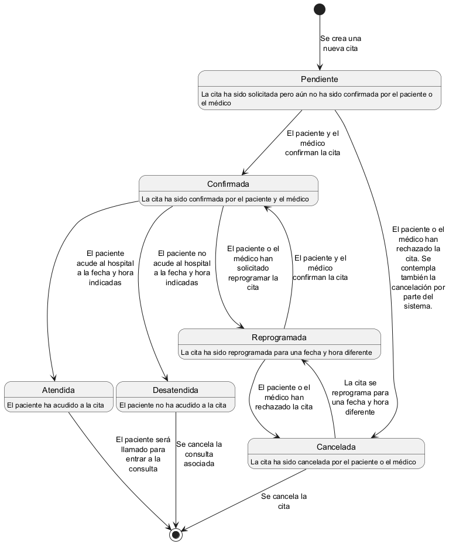

# Diagrama de estados del ciclo de vida de la cita



## Código fuente
El anterior diagrama de estados fue generado con la herramienta [PlantUML](https://plantuml.com/), utilizando el siguiente código fuente:

```
@startuml Cita

skinparam maxMessageSize 100
skinparam wrapWidth 400

[*] --> Pendiente : Se crea una nueva cita

Pendiente : La cita ha sido solicitada pero aún no ha sido confirmada por el paciente o el médico
Pendiente --> Confirmada : El paciente y el médico confirman la cita
Pendiente --> Cancelada : El paciente o el médico han rechazado la cita. Se contempla también la cancelación por parte del sistema.

Confirmada : La cita ha sido confirmada por el paciente y el médico
Confirmada --> Atendida : El paciente acude al hospital a la fecha y hora indicadas
Confirmada --> Desatendida : El paciente no acude al hospital a la fecha y hora indicadas
Confirmada --> Reprogramada : El paciente o el médico han solicitado reprogramar la cita

Cancelada : La cita ha sido cancelada por el paciente o el médico
Cancelada --> Reprogramada : La cita se reprograma para una fecha y hora diferente
Cancelada --> [*] : Se cancela la cita

Reprogramada : La cita ha sido reprogramada para una fecha y hora diferente
Reprogramada --> Confirmada : El paciente y el médico confirman la cita
Reprogramada --> Cancelada : El paciente o el médico han rechazado la cita

Atendida : El paciente ha acudido a la cita
Atendida --> [*] : El paciente será llamado para entrar a la consulta

Desatendida : El paciente no ha acudido a la cita
Desatendida --> [*] : Se cancela la consulta asociada

@enduml
```
