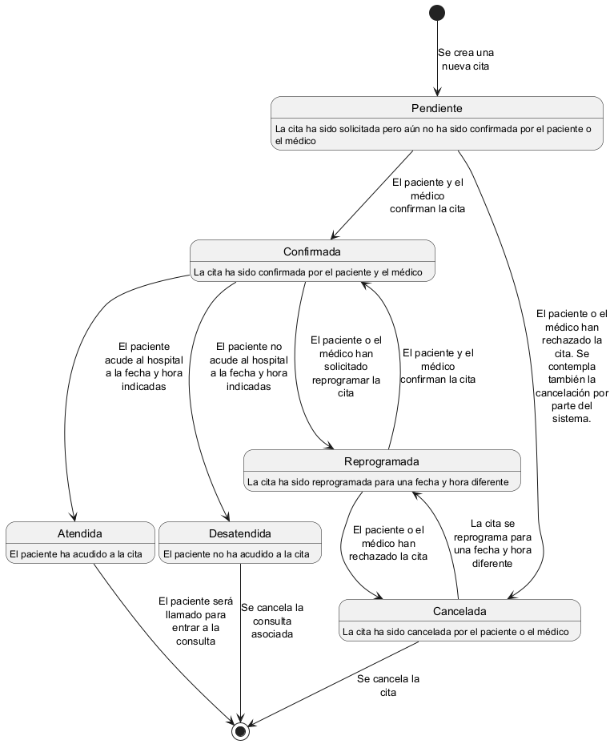
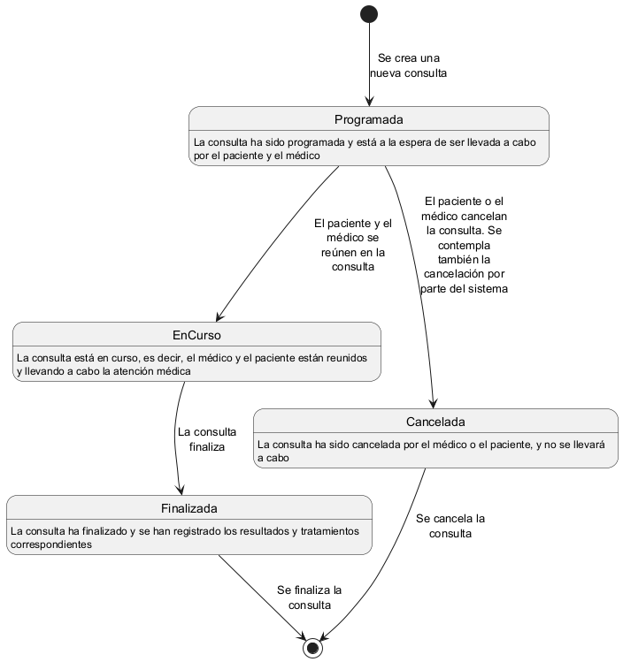

# Dominio _Citas_

Este dominio se encarga de gestionar la coordinación de citas y consultas médicas entre pacientes y médicos, asegurando que los recursos necesarios estén disponibles y que las consultas se realicen de manera eficiente y segura.

Ha de diferenciarse los términos citas y consultas. Las citas son los eventos en los que se establece una fecha y hora para la consulta, mientras que las consultas son las reuniones entre médicos y pacientes en las que se lleva a cabo la atención médica. Una consulta no necesariamente tiene que estar asociada a una cita, ya que podría ser, por ejemplo, una atención de urgencia.

## Responsabilidades
- Coordinación de citas y consultas médicas entre pacientes y médicos.
- Asignación de recursos y equipos médicos necesarios para cada consulta.
- Registro y seguimiento de las citas y consultas realizadas, incluyendo información sobre el estado y resultados.

Esto se conseguirá mediante la gestión de entidades que representan las citas y consultas médicas, así como los recursos necesarios para llevarlas a cabo.

## Entidades
- `Cita`: Representa una cita médica entre un paciente y una consulta, con información sobre la fecha, hora, consulta asociada y estado de la cita.
- `Consulta`: Define una reunión entre un médico y un paciente, con información sobre el médico, paciente, motivo de la consulta y resultados.

Estas entidades se encargarán de almacenar y gestionar la información necesaria para cumplir con las responsabilidades del dominio.

### Entidad `Cita`
La entidad `Cita` representa una cita médica entre un paciente y una consulta, con información sobre la fecha, hora, consulta asociada y estado de la cita. Esta entidad se encarga de gestionar la coordinación de pacientes y consultas, asegurando que los pacientes y médicos estén disponibles y que los recursos necesarios estén reservados para la consulta.

#### Atributos
Para la entidad `Cita` se han identificado los siguientes atributos comunes a la mayoría de los sistemas de gestión de citas:
- `ID`: Identificador único de la cita.
- `Fecha`: Fecha y hora en la que se realizará la cita.
- `Paciente`: Paciente que asistirá a la cita.
- `Consulta`: Consulta médica asociada a la cita.
- `Estado`: Estado actual de la cita (pendiente, confirmada, cancelada, realizada, reprogrmada, etc).
- `Observaciones`: Información adicional sobre la cita, como instrucciones especiales o comentarios relevantes.

#### Ciclo de Vida
El ciclo de vida de una cita en el sistema consta de las siguientes fases (no necesariamente en este orden):
1. **Pendiente**: La cita ha sido solicitada pero aún no ha sido confirmada por el paciente o el médico.
2. **Confirmada**: La cita ha sido confirmada por el paciente y el médico, y está programada para la fecha y hora establecidas.
3. **Cancelada**: La cita ha sido cancelada por el paciente o el médico, y no se llevará a cabo.
4. **Reprogramada**: La cita ha sido reprogramada para una fecha y hora diferente.
5. **Atendida**: El paciente ha acudido a la cita. Será llamado para entrar a la consulta.
6. **Desantendida**: El paciente no ha acudido a la cita. Se cancela la consulta asociada.

En el siguiente diagrama de estados se muestra el ciclo de vida de una cita en el sistema:

### Entidad `Consulta`
La entidad `Consulta` define una reunión entre un médico y un paciente, con información sobre el médico, paciente, motivo de la consulta y resultados. Esta entidad se encarga de gestionar la atención médica, asegurando que el médico tenga la información necesaria para atender al paciente, que los resultados de la consulta se registren de manera adecuada y que los recursos necesarios estén disponibles.

#### Atributos
Para la entidad `Consulta` se han identificado los siguientes atributos comunes a la mayoría de los sistemas de gestión de consultas:
- `ID`: Identificador único de la consulta.
- `Fecha`: Fecha y hora en la que se realizó la consulta.
- `Médico`: Médico que atiende la consulta.
- `Paciente`: Paciente que asiste a la consulta.
- `Motivo`: Motivo de la consulta, es decir, la razón por la que el paciente solicita atención médica.
- `HistorialMedico`: Lista de historiales médicos asociados a la consulta, junto su diagnóstico y tratamientos.

#### Ciclo de Vida
El ciclo de vida de una consulta en el sistema consta de las siguientes fases (no necesariamente en este orden):
1. **Programada**: La consulta ha sido programada para una fecha y hora específicas.
2. **EnCurso**: La consulta está en curso, es decir, el médico y el paciente están reunidos y llevando a cabo la atención médica.
3. **Finalizada**: La consulta ha finalizado y se han registrado los resultados y tratamientos correspondientes.
4. **Cancelada**: La consulta ha sido cancelada por el médico o el paciente, y no se llevará a cabo.

En el siguiente diagrama de estados se muestra el ciclo de vida de una consulta en el sistema:

