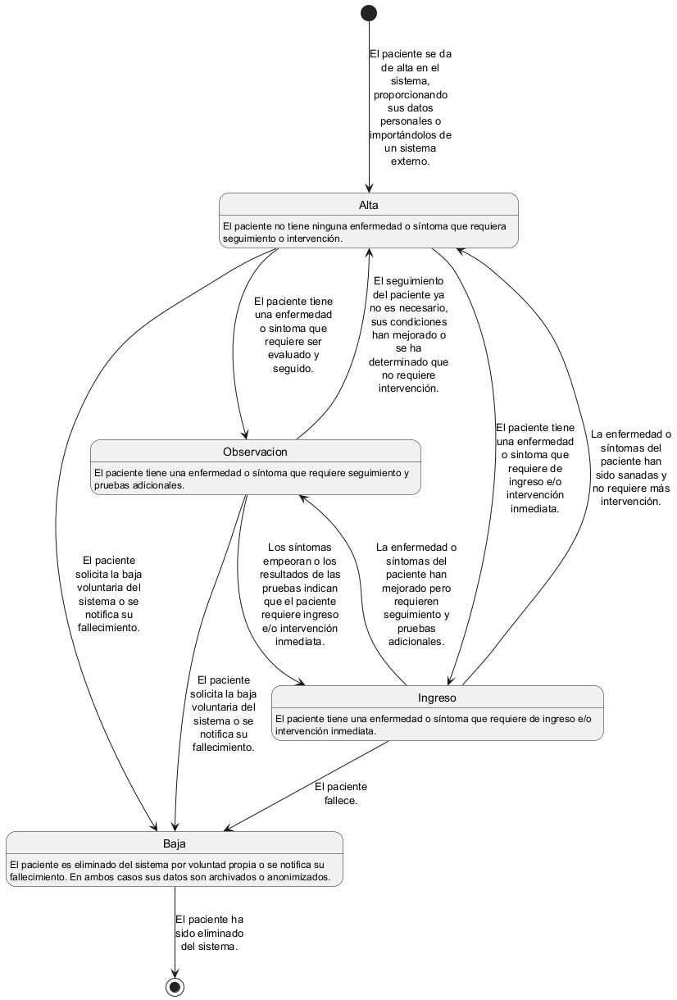
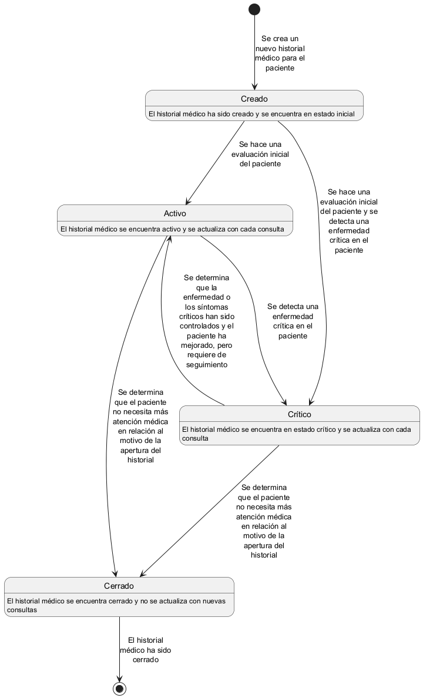

# Dominio _Pacientes_

Este dominio se encarga de gestionar la información personal y médica de los pacientes, incluyendo el almacenamiento y actualización del historial médico. Además, proporciona información relevante a otros dominios cuando se realiza una consulta o cita.

## Responsabilidades

Entre las responsabilidades de este dominio se encuentran:
- Gestión de la información personal y médica de los pacientes.
- Almacenamiento y actualización del historial médico.
- Proporcionar información relevante a otros dominios cuando se realiza una consulta o cita.

Esto se conseguirá mediante el reparto de responsabilidades entre entidades que representan a los pacientes y su historial médico.

## Entidades

Las entidades principales de este dominio son:
- `Paciente`: Representa a un paciente en el sistema, con su información personal y médica.
- `HistorialMédico`: Almacena el historial médico de una enfermedad específica de un paciente, incluyendo diagnósticos, tratamientos y visitas médicas.

Estas entidades se encargarán de almacenar y gestionar la información necesaria para cumplir con las responsabilidades del dominio.

### Entidad `Paciente`

La entidad `Paciente` representa a un paciente en el sistema, con su información personal y médica. Esta entidad se encarga de almacenar y gestionar los datos personales y médicos de cada paciente, permitiendo su acceso y actualización por parte de otros dominios. 

#### Atributos
Para la entidad `Paciente` se han identificado los siguientes atributos comounes a la mayoría de los sistemas de gestión de pacientes:
- `ID`: Identificador único del paciente
- `Nombre`: Nombre completo del paciente
- `Estado`: Estado actual del paciente
- `FechaNacimiento`: Fecha de nacimiento del paciente
- `Sexo`: Género del paciente
- `Dirección`: Dirección de residencia del paciente
- `Teléfono`: Número de teléfono de contacto del paciente
- `Email`: Dirección de correo electrónico del paciente
- `HistorialMédico`: Referencia al historial médico del paciente

#### Ciclo de Vida

El ciclo de vida de un paciente en el sistema consta de las siguientes fases (no necesariamente en este orden):

1. **Alta**: Estado inicial de cualquier nuevo paciente. El paciente no tiene ninguna enfermedad o síntoma que requiera seguimiento o intervención.
2. **Observación**: El paciente tiene una enfermedad o síntoma que requiere seguimiento y pruebas adicionales.
3. **Ingreso**: El paciente tiene una enfermedad o síntoma que requiere de ingreso e/o intervención inmediata.
4. **Baja**: El paciente es eliminado del sistema por voluntad propia o se notifica su fallecimiento. En ambos casos sus datos son archivados o anonimizados.

En el siguiente diagrama de estados se muestra el ciclo de vida de un paciente en el sistema:

### Entidad `HistorialMédico`

La entidad `HistorialMédico` almacena el historial médico de un paciente, incluyendo diagnósticos, tratamientos y visitas médicas. Esta entidad se encarga de mantener un registro actualizado de la información médica relevante de cada paciente, permitiendo su consulta y actualización por parte del personal médico.

Existirá un historial médico principal por cada paciente, que contendrá la información más relevante y actualizada sobre su estado de salud. 

Por cada caso específico o temporal (como una enfermedad o lesión), se podrán crear historiales médicos adicionales que se asociarán al historial médico principal del paciente.

#### Atributos

Para la entidad `HistorialMédico` se han identificado los siguientes atributos comunes a la mayoría de los sistemas de gestión de historiales médicos:
- `ID`: Identificador único del historial médico
- `Paciente`: Referencia al paciente al que pertenece el historial médico
- `Estado`: Estado actual del historial médico (activo, crítico, cerrado, etc.)
- `FechaCreación`: Fecha de creación del historial médico
- `FechaActualización`: Fecha de última actualización del historial médico
- `Diagnósticos`: Lista de diagnósticos realizados al paciente
- `Tratamientos`: Lista de tratamientos aplicados al paciente
- `Notas`: Notas adicionales sobre el historial médico

#### Ciclo de Vida

El ciclo de vida de un historial médico en el sistema consta de las siguientes fases:

1. **Creado**: El historial médico ha sido creado y se encuentra en estado inicial.
2. **Activo**: El historial médico se encuentra activo y se actualiza con cada consulta.
3. **Crítico**: El historial médico se encuentra en estado crítico y se actualiza con cada consulta
4. **Cerrado**: El historial médico se encuentra cerrado y no se actualiza con nuevas consultas.

En el siguiente diagrama de estados se muestra el ciclo de vida de un historial médico en el sistema:

