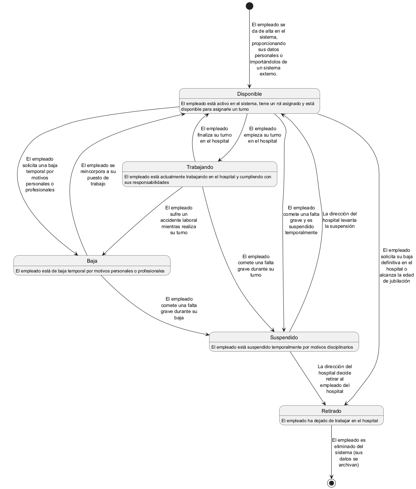

# Dominio _Personal_

Este dominio se encarga de gestionar la información personal y profesional de todo el personal del hospital, incluyendo médicos, personal de limpieza, mantenimiento, y administrativo. Además, se ocupa de la gestión y asignación de turnos de trabajo, así como de la coordinación entre los distintos miembros del personal para garantizar una operación eficiente en el hospital.

## Responsabilidades

Entre las responsabilidades de este dominio se encuentran:
- Gestión de la información personal y profesional de todo el personal del hospital.
- Asignación y gestión de turnos de trabajo para asegurar la adecuada cobertura en todas las áreas del hospital.
- Coordinación entre los miembros del personal de diferentes áreas para facilitar la colaboración y eficiencia en el trabajo.

Esto se conseguirá mediante el reparto de responsabilidades entre entidades que representan a los empleados y los turnos de trabajo.

## Entidades

Las entidades principales de este dominio son:
- `Empleado`: Representa a un miembro del personal del hospital, con su información personal y profesional.
- `Turno`: Define los horarios y turnos de trabajo asignados a cada miembro del personal, gestionando la disponibilidad y asegurando que todos los turnos sean cubiertos de manera efectiva.

Estas entidades se encargarán de almacenar y gestionar la información necesaria para cumplir con las responsabilidades del dominio.

### Entidad `Empleado`

La entidad `Empleado` representa a un miembro del personal del hospital, incluyendo su información personal y profesional. Esta entidad se encarga de almacenar y gestionar los datos relacionados con la identidad, el rol y la disponibilidad del empleado, permitiendo su acceso y actualización por parte de otros dominios cuando sea necesario.

#### Atributos

Para la entidad `Empleado` se han identificado los siguientes atributos comunes a la mayoría de los sistemas de gestión de personal:
- `ID`: Identificador único del empleado.
- `Nombre`: Nombre completo del empleado.
- `FechaNacimiento`: Fecha de nacimiento del empleado.
- `Sexo`: Género del empleado.
- `Dirección`: Dirección de residencia del empleado.
- `Teléfono`: Número de teléfono de contacto del empleado.
- `Email`: Dirección de correo electrónico del empleado.
- `Rol`: Rol o puesto que desempeña el empleado dentro del hospital (por ejemplo, médico, enfermero, personal de limpieza).
- `Especialidad`: En caso de ser personal médico, la especialidad del empleado (por ejemplo, cardiología, pediatría).
- `Estado`: Estado actual del empleado (activo, de baja, suspendido, retirado).

#### Ciclo de Vida

El ciclo de vida de un empleado en el sistema consta de las siguientes fases (no necesariamente en este orden):

1. **Disponible**: El empleado está activo en el sistema, tiene un rol asignado y está disponible para asignarle un turno.
2. **Trabajando**: El empleado está actualmente trabajando en el hospital y cumpliendo con sus responsabilidades.
3. **Baja**: El empleado está de baja temporal por motivos personales o profesionales.
4. **Suspendido**: El empleado ha sido suspendido temporalmente por motivos disciplinarios o legales.
5. **Retirado**: El empleado ha dejado de trabajar en el hospital y sus datos han sido archivados o eliminados.

En el siguiente diagrama de estados se muestra el ciclo de vida de un empleado en el sistema:

### Entidad `Turno`

La entidad `Turno` define los horarios y turnos de trabajo asignados a cada miembro del personal. Esta entidad se encarga de gestionar la disponibilidad del personal, asegurando que todos los turnos necesarios sean cubiertos y que los empleados asignados estén disponibles para sus responsabilidades.

#### Atributos

Para la entidad `Turno` se han identificado los siguientes atributos comunes a la mayoría de los sistemas de gestión de turnos:
- `ID`: Identificador único del turno.
- `Empleado`: Referencia al empleado asignado al turno.
- `FechaInicio`: Fecha y hora de inicio del turno.
- `FechaFin`: Fecha y hora de finalización del turno.
- `Estado`: Estado actual del turno (asignado, completado, cancelado).

#### Ciclo de Vida

El ciclo de vida de un turno en el sistema consta de las siguientes fases:

1. **Programado**: El turno ha sido asignado a un empleado y está programado para una fecha y hora específicas.
2. **Asignado**: El turno está próximo a comenzar y el empleado ha sido notificado.
3. **EnCurso**: El turno está actualmente en desarrollo, y el empleado está cumpliendo con sus responsabilidades.
4. **Finalizado**: El turno ha finalizado y se ha registrado como completado.
5. **Cancelado**: El turno ha sido cancelado antes de que comenzara, y no se llevará a cabo.

En el siguiente diagrama de estados se muestra el ciclo de vida de un turno en el sistema:

