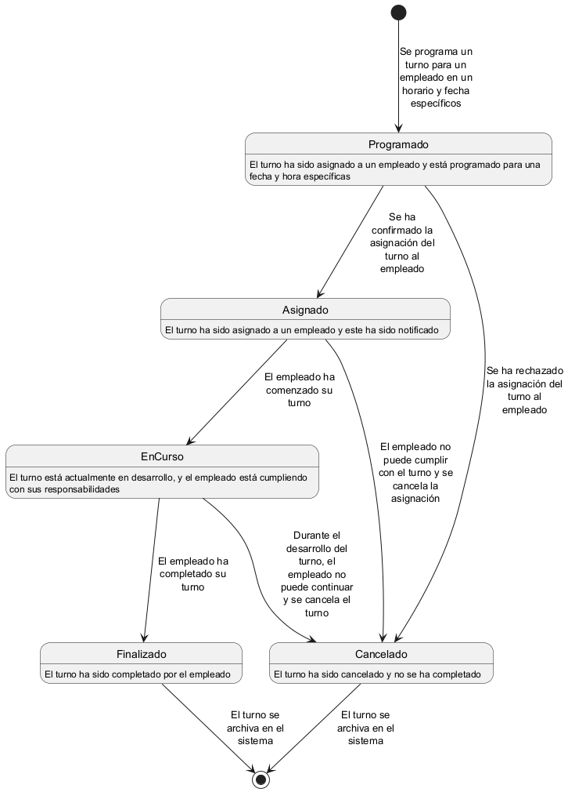

# Diagrama de estados del ciclo de vida del turno



## Código fuente
El anterior diagrama de estados fue generado con la herramienta [PlantUML](https://plantuml.com/), utilizando el siguiente código fuente:

```
@startuml Turno

skinparam maxMessageSize 100
skinparam wrapWidth 400

[*] --> Programado : Se programa un turno para un empleado en un horario y fecha específicos

Programado : El turno ha sido asignado a un empleado y está programado para una fecha y hora específicas
Programado --> Asignado : Se ha confirmado la asignación del turno al empleado
Programado --> Cancelado : Se ha rechazado la asignación del turno al empleado

Asignado : El turno ha sido asignado a un empleado y este ha sido notificado
Asignado --> EnCurso : El empleado ha comenzado su turno
Asignado --> Cancelado : El empleado no puede cumplir con el turno y se cancela la asignación

EnCurso : El turno está actualmente en desarrollo, y el empleado está cumpliendo con sus responsabilidades
EnCurso --> Finalizado : El empleado ha completado su turno
EnCurso --> Cancelado : Durante el desarrollo del turno, el empleado no puede continuar y se cancela el turno

Finalizado : El turno ha sido completado por el empleado
Finalizado --> [*] : El turno se archiva en el sistema

Cancelado: El turno ha sido cancelado y no se ha completado
Cancelado --> [*] : El turno se archiva en el sistema

@enduml
```