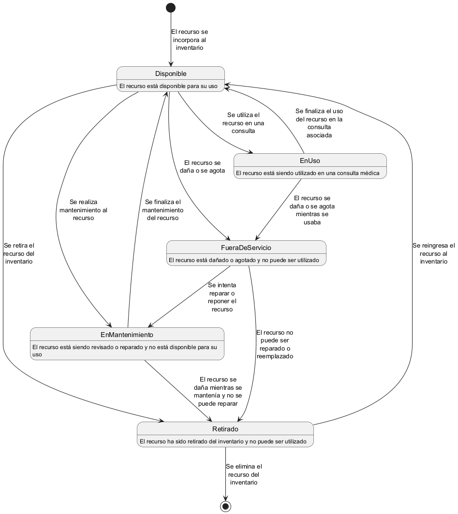
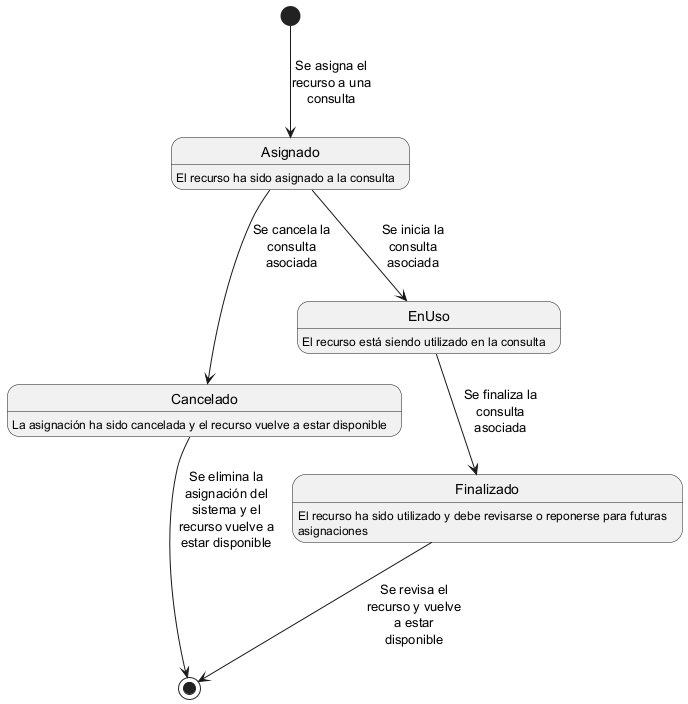

# Dominio _Recursos_

Este dominio se encarga de gestionar los recursos y equipos médicos disponibles en el hospital, asegurando que estén en buen estado, disponibles para su uso y que se asignen de manera adecuada a las citas y consultas médicas.

## Responsabilidades
- Gestión de los recursos y equipos médicos disponibles en el hospital.
- Control de inventario y planificación de mantenimiento de los recursos.
- Asignación y reserva de recursos para las citas y consultas médicas.
- Monitoreo de la disponibilidad y uso de los recursos en tiempo real.

Esto se conseguirá mediante la gestión de entidades que representan los recursos y equipos médicos, así como las asignaciones de recursos a citas y consultas médicas.

## Entidades
- `Recurso`: Representa un recurso o equipo médico, con información sobre el tipo, cantidad, estado y ubicación.
- `Asignación`: Representa la asignación de un recurso a una cita o consulta médica específica.

### Entidad `Recurso`
Se distinguen dos tipos de recursos:
- **Recursos mayores**: Equipos médicos grandes y costosos, como resonancias magnéticas, tomógrafos, etc.
- **Recursos menores**: Equipos médicos más pequeños y económicos, como tensiómetros, termómetros, etc.

Cada recurso mayor tendrá su propia entidad, con cantidad única e información específica sobre el recurso. 

Los recursos menores se agruparán en categorías, con cantidad variable y atributos comunes a todos los recursos de esa categoría.

#### Atributos
Para la entidad `Recurso` se han identificado los siguientes atributos comunes a la mayoría de los sistemas de gestión de recursos:
- `ID`: Identificador único del recurso.
- `Nombre`: Nombre o descripción del recurso.
- `Tipo`: Tipo de recurso (mayor o menor).
- `Categoria`: Categoría a la que pertenece el recurso (enfermería, diagnóstico, quirúrgico, etc).
- `Cantidad`: Cantidad disponible del recurso.
- `Estado`: Estado actual del recurso (disponible, en uso, en mantenimiento, etc).
- `Ubicacion`: Ubicación física del recurso en el hospital.
- `UltimoMantenimiento`: Fecha del último mantenimiento o revisión realizado al recurso.

#### Ciclo de Vida
El ciclo de vida de un recurso en el sistema consta de las siguientes fases (no necesariamente en este orden):
1. **Disponible**: El recurso está disponible para su uso.
2. **EnUso**: El recurso está siendo utilizado en una consulta médica.
3. **EnMantenimiento**: El recurso está siendo revisado o reparado y no está disponible para su uso.
4. **FueraDeServicio**: El recurso está dañado o agotado y no puede ser utilizado.
5. **Retirado**: El recurso ha sido retirado del inventario y no está disponible para su uso.

En el siguiente diagrama de estados se muestra el ciclo de vida de un recurso en el sistema:

### Entidad `Asignación`
La entidad `Asignación` representa la asignación de un recurso a una cita o consulta médica específica. Esta entidad se encarga de gestionar la disponibilidad y reserva de recursos para las citas y consultas, asegurando que los recursos necesarios estén disponibles en el momento adecuado.

#### Atributos
Para la entidad `Asignación` se han identificado los siguientes atributos comunes a la mayoría de los sistemas de gestión de asignaciones:
- `ID`: Identificador único de la asignación.
- `Recurso`: Recurso asignado a la cita o consulta.
- `Consulta`: Consulta médica a la que se asigna el recurso.
- `Cantidad`: Cantidad de recursos asignados.

#### Ciclo de Vida
El ciclo de vida de una asignación en el sistema consta de las siguientes fases (no necesariamente en este orden):
1. **Asignado**: El recurso ha sido asignado a la consulta.
2. **EnUso**: El recurso está siendo utilizado en la consulta.
3. **Finalizado**: El recurso ha sido utilizado y debe revisarse o reponerse para futuras asignaciones.
4. **Cancelado**: La asignación ha sido cancelada y el recurso vuelve a estar disponible.

En el siguiente diagrama de estados se muestra el ciclo de vida de una asignación en el sistema:

