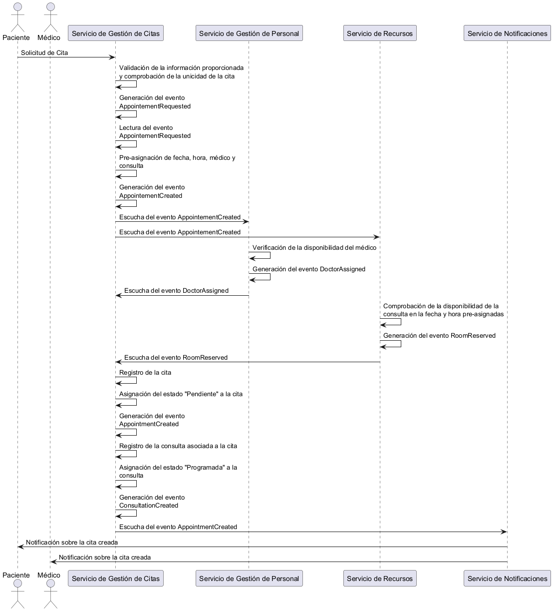

# Citas: Eventos posibles

## Solicitud de cita

### Escenario principal: Cita programada

### [WIP] Escenario alternativo:
Podría diseñarse eventos como:
- Consulta no disponible
- Médico no disponible
- Recursos médicos no disponibles
- etc.